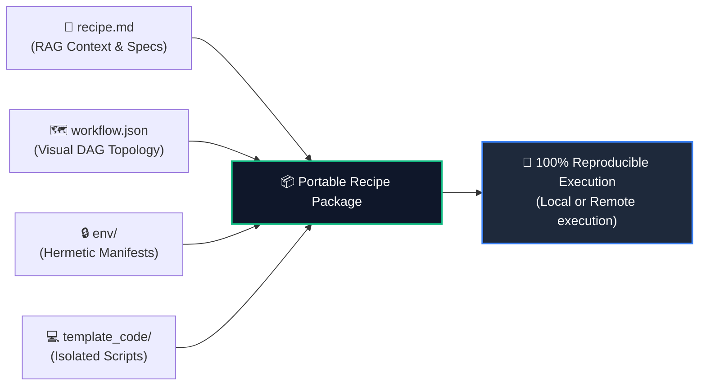

<p align="center">
  <a href="https://rolv.io">
    
  </a>
</p>
<h1 align="center">Rolv Recipe Specification & Authoring Guide</h1>
<p align="center">
  <strong>Self-contained, reproducible, agent-ready analytical workflows for life sciences & computational biology.</strong>
</p>

<p align="center">
  <a href="https://rolv.io"></a>
  <a href="https://github.com/rolv-io/recipe/tree/main/examples"></a>
  
  
</p>

---

> [!NOTE]
> A **Recipe** is a versioned, portable scientific workflow package. It encapsulates visual DAG topology, isolated scripts, hermetic environment locks, and operational troubleshooting knowledge.
> 
<p align="center">
  👉 <strong><a href="https://github.com/rolv-io/recipe/tree/main/examples">Explore an example recipes in the repository →</a></strong>
</p>

---

### 🧬 The Anatomy of a Recipe


# Rolv Recipe Specification & Authoring Guide

A **Recipe** is a self-contained, versioned, and reproducible scientific analysis workflow package. It encapsulates data flow (DAG), execution scripts, environment locks, documentation, and troubleshooting knowledge.

Recipes serve as executable pipelines/workflows on the visual canvas and can be indexed in a **knowledge base** in Rolv’s local and cloud databases.
Potentially, the recipe format can be adopted by other AI agents as the format resembles skill files. 

An example recipe is here: https://github.com/rolv-io/recipe/tree/main/examples

---

## 1. Recipe Package Structure (File Tree)

To build a recipe outside of Rolv (e.g., in a code editor or git repository), create a directory with the following structure:

```
my-recipe/
├── recipe.md                  # [Required] Metadata & documentation (YAML frontmatter + Markdown)
├── workflow.json              # [Recommended] Visual DAG definition (nodes, edges, port contracts)
├── troubleshooting.md         # [Optional] Known errors, constraints, and workarounds
├── env/                       # [Recommended] Hermetic runtime dependency manifests
│   ├── python-requirements.txt
│   ├── r-packages.txt
│   └── system-tools.txt
└── template_code/             # [Required for compute] Standalone executable scripts
    ├── step1_qc.py
    └── step2_analysis.R
```


---

## 2. File Specifications

### 2.1 `recipe.md` (Required)
Defines identity metadata via YAML frontmatter and provides end-user documentation.

```markdown
---
id: bulk-rnaseq-analysis
name: Bulk RNA-seq Analysis
version: 1
type: user
---

# Bulk RNA-seq Analysis

## What this recipe does
Performs quality control, size-factor normalization, and differential expression analysis comparing control and treated conditions using DESeq2.

## Steps
1. Data Ingestion
   Reads raw count matrix and sample condition metadata.
2. Normalization & QC
   Filters low-count genes and estimates size factors.
   Code: `template_code/step1_qc.R`
3. Differential Expression
   Fits negative binomial GLM and generates volcano plot.
   Code: `template_code/step2_deseq.R`
4. Marker Gene Research
   Searches PubMed for top up-regulated genes.
5. Artifact Ledger
   Compiles output tables and figures.

## Environment
Dependencies are listed in:
- `env/python-requirements.txt` (Python >=3.10)
- `env/r-packages.txt` (R >=4.4)
- `env/system-tools.txt`

## Notes
Review steps, code, and dependencies as needed.
```

#### Schema Reference:
* **Frontmatter**:
  * `id`: Unique lowercase slug with hyphens (e.g., `bulk-rnaseq-analysis`).
  * `name`: Human-readable title of the recipe.
  * `version`: Integer revision (`1`, `2`, ...). Synchronized automatically upon Cloud Library publish.
  * `type`: Recipe origin (`user`, `team`, or `validated`).
* **Sections in Order**:
  1. `# <Recipe Name>`: Top-level title matching `name`.
  2. `## What this recipe does`: Scientific overview and methodological summary.
  3. `## Steps`: Topologically sorted list (`1. <Node Label>`).
     * Indented line 1 (3 spaces): Node description.
     * Indented line 2 (3 spaces): Script location for compute nodes (`Code: \`template_code/<path>\``).
  4. `## Environment`: Fixed bulleted list referencing dependency manifests with runtime pins.
  5. `## Notes`: Operational guidance, constraints, or author review notes.

---

### 2.2 `workflow.json` (Recommended)
Defines the DAG topology, node contracts, and error-recovery policies.

```json
{
  "id": "bulk-rnaseq-analysis",
  "nodes": [
    {
      "id": "node_input",
      "name": "Data Ingestion",
      "description": "User-supplied counts and metadata tables",
      "kind": "manual",
      "node_type": "data_input",
      "expects": [],
      "produces": ["count_matrix", "metadata"],
      "bindings": {
        "INPUT_FILE": {
          "value": "",
          "description": "Raw count matrix (CSV/TSV)"
        },
        "METADATA_FILE": {
          "value": "",
          "description": "Sample condition metadata (CSV/TSV)"
        }
      }
    },
    {
      "id": "step_1",
      "name": "Normalization & QC",
      "description": "Filters low-count genes and estimates size factors",
      "kind": "script",
      "node_type": "compute",
      "language": "r",
      "path": "template_code/step1_qc.R",
      "expects": ["count_matrix"],
      "produces": ["normalized_counts"],
      "troubleshooting_policy": "normal",
      "self_correct": true,
      "max_retries": 3
    },
    {
      "id": "step_2",
      "name": "Differential Expression",
      "description": "Fits negative binomial GLM and generates volcano plot",
      "kind": "script",
      "node_type": "compute",
      "language": "r",
      "path": "template_code/step2_deseq.R",
      "expects": ["normalized_counts"],
      "produces": ["de_table", "volcano_plot"],
      "is_core": true,
      "troubleshooting_policy": "touch_last",
      "troubleshooting_reason": "Core contrast formulas must remain preserved",
      "self_correct": true,
      "max_retries": 2
    },
    {
      "id": "step_3",
      "name": "Marker Gene Research",
      "description": "Searches PubMed for top up-regulated genes",
      "kind": "agent",
      "node_type": "research",
      "language": "agent",
      "research_mode": "literature",
      "instructions": "Search PubMed for top 5 up-regulated genes and summarize associated pathways",
      "structured_output": true,
      "structured_fields": "gene_symbol, p_val, log2fc, pubmed_summary",
      "expects": ["de_table"],
      "produces": ["literature_report"]
    },
    {
      "id": "node_output",
      "name": "Artifact Ledger",
      "description": "Terminal ledger tracking all produced files and figures",
      "kind": "manual",
      "node_type": "data_output",
      "expects": ["volcano_plot", "literature_report"],
      "produces": []
    }
  ],
  "edges": [
    { "from": "node_input", "to": "step_1" },
    { "from": "step_1", "to": "step_2" },
    { "from": "step_2", "to": "step_3" },
    { "from": "step_3", "to": "node_output" }
  ]
}
```

#### Node Field Reference:
* **`id` / `name` / `description`**: Identifiers and descriptions for the node.
* **`node_type` & `kind`**:
  * Compute nodes: `"node_type": "compute"`, `"kind": "script"`
  * Research nodes: `"node_type": "research"`, `"kind": "agent"`
  * Data Input / Output nodes: `"node_type": "data_input"` | `"data_output"`, `"kind": "manual"`
* **`language`**:
  * `"r"`, `"python"`, or `"bash"` for compute nodes.
  * `"agent"` for research nodes.
  * Omitted for I/O nodes.
* **`path`**: Relative path to the code file under `template_code/` (compute nodes only).
* **`bindings`**: *(Data Input only)* Parameter definitions. For portability, `value` paths are blanked (`""`) on export.
* **`expects` & `produces`**: Arrays of artifact labels. Used by Rolv’s **Mid-Workflow Entry Matching** engine (`findEntryPoint`) to automatically skip completed upstream steps when intermediate files are provided.
* **`troubleshooting_policy`**:
  * `"normal"`: Standard AI auto-healing.
  * `"touch_last"`: Marks a protected golden node (`is_core: true`). The auto-healing engine fixes upstream input adapters first and respects `troubleshooting_reason` before editing this code.
* **`edges`**: Directed connections between nodes. **Must use `"from"` and `"to"`** (e.g. `{ "from": "step_1", "to": "step_2" }`).

---


### 2.3 `template_code/` (Scripts & Execution Rules)

Each compute node references a standalone script file under `template_code/`.

#### Critical Node Isolation Rule (`NODE_ISOLATION_RULE`)
To ensure complete reproducibility and compatibility with Rolv's multi-process runner:
1. **Zero Shared Memory**: Nodes run as isolated subprocesses. Do not rely on global in-memory variables.
2. **Reading Inputs**:
   * Global bindings and input file paths are read from `input.json` in the current working directory.
   * Upstream outputs are read directly from disk by filename (e.g., `readRDS("normalized_counts.rds")` or `pd.read_csv("clean_data.csv")`).
3. **Writing Outputs**:
   * Scripts must write all output tables and figures to the current working directory using static filenames.
   * Do not hardcode timestamps, custom manifest files, or temporary system paths (`/tmp`).

#### Example R Script (`template_code/step1_qc.R`):
```r
library(jsonlite)

# 1. Read input bindings from input.json
inputs <- jsonlite::fromJSON("input.json")
input_file <- inputs$INPUT_FILE
padj_cutoff <- as.numeric(inputs$PADJ_CUTOFF %||% 0.05)

# 2. Perform computation
counts <- read.csv(input_file, row.names = 1, check.names = FALSE)
filtered_counts <- counts[rowSums(counts) > 10, ]

# 3. Write intermediate outputs to disk for downstream nodes
saveRDS(filtered_counts, file = "normalized_counts.rds")
cat("Normalized counts saved to normalized_counts.rds\n")
```

---

### 2.4 `env/` (Environment Manifests)

Isolates package dependencies so the recipe can be deterministically reproduced across different machines:

* **`env/python-requirements.txt`**: Pinned pip/conda requirements (e.g., `scanpy==1.10.1`, `pandas>=2.0.0`). *Standard library packages (`os`, `sys`, `json`) are omitted.*
* **`env/r-packages.txt`**: CRAN/Bioconductor packages (e.g., `DESeq2`, `Seurat`, `ggplot2`). *Base R packages (`stats`, `base`, `utils`) are omitted.*
* **`env/system-tools.txt`**: CLI binaries installed via Mamba/Conda (e.g., `samtools`, `bedtools`, `fastqc`).

---

### 2.5 `troubleshooting.md` (Optional)

Documents edge cases, past debugging notes, and common runtime errors. When an execution fails, Rolv injects relevant sections of this document into the AI auto-healing context.

```markdown
# Troubleshooting Notes

### Low Count Warning
If samples have fewer than 100,000 total reads, DESeq2 size factor estimation may fail.
*Fix:* Check sequencing depth and verify the input matrix contains raw counts, not pre-normalized TPMs.

### R 4.4+ Matrix Compatibility
Ensure `Matrix` package is >= 1.6-0 to avoid S4 class dispatch errors in Seurat.
```

---

## 3. How Rolv Streamlines Recipe Creation & Execution

Building a recipe manually by editing JSON and text files is completely optional. Inside the **Rolv Desktop App**, this entire process is automated:

### 1. Derive on Demand (Chat ➔ Recipe)
* Start with exploratory data analysis in conversational chat.
* Once the analysis succeeds, click **"Step into Graph"** or **"Extract to Pipeline"**. Rolv's Architect agent parses your conversation history, modularizes the steps, and creates the visual DAG canvas automatically.

### 2. Visual Recipe Designer & Code Editor
* Reorder, connect, or add nodes using a visual drag-and-drop interface powered by React Flow.
* Edit scripts directly in the app using the built-in **CodeMirror** editor (with syntax highlighting for R, Python, and Bash, keyboard shortcuts, and line numbers).

### 3. Automated Manifest Generation on Save
* When you click **"Save as Recipe"**, Rolv automatically:
  * Analyzes your code AST to discover imported R libraries and Python modules.
  * Writes `env/python-requirements.txt`, `env/r-packages.txt`, and `env/system-tools.txt` automatically.
  * Sanitizes `workflow.json` by clearing local system paths from `INPUT_FILE` to keep the recipe portable.
  * Generates clean `recipe.md` metadata with versioning.

### 4. Automated Snakemake & Nextflow Ingestion
* If you already have existing pipelines, click **Import** in the Recipe Browser.
* Rolv uses LLM + regex parsers to ingest `Snakefile` or `main.nf` workflows, converting them into modular visual recipes with isolated node contracts and environment manifests.

### 5. Mid-Workflow Entry Matching
* When running a recipe on a new dataset, you don't have to start from Step 1. If you already have an intermediate file (e.g., normalized counts), Rolv's matching engine identifies where your data enters the DAG and automatically skips upstream compute nodes.

### 6. Team Collaboration & Smart Merge
* **One-Click Folder Import/Export**: Export any recipe to disk as a portable folder or import an existing folder into your local LanceDB vault.
* **Cloud Library & Smart Merge**: Publish recipes to your team or the global cloud. When an upstream author releases a new version, Rolv's **Smart 3-Way Merge** preserves your custom local tweaks while adopting upstream bug fixes and package updates.

